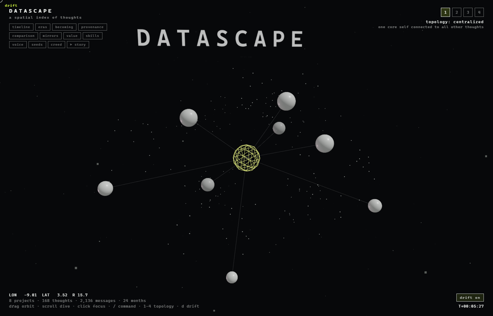

# Datascape

A 3D landscape of your own thinking — a portfolio you *fly through* instead of
scroll. Every project is a node sized by how much it mattered; every
conversation you ever had with an AI becomes a dot in the cloud around them.
Ask it questions, filter by era, watch it narrate itself.

It ships with a **synthetic demo** so it runs the moment you clone it, and it's
built so the **code carries no data** — you point it at your own, hosted
wherever you like.



---

## Quickstart

```bash
npm install
npm run dev
```

Open the local URL. You'll see the landscape of a fictional maker, *Sam Rivers*
— eight projects and 168 conversations of invented data from
`public/sample-data/`. Nothing to configure.

To build:

```bash
npm run build      # → dist/
npm run preview    # serve the build locally
```

---

## Make it yours

Everything a forker touches lives in **one file**: [`datascape.config.js`](datascape.config.js).

```js
export const config = {
  siteName: "Datascape",              // wordmark, tab title, breadcrumbs
  tagline: "a spatial index of thoughts",
  dataBase: import.meta.env.VITE_DATA_BASE || "/sample-data/",  // ← your data
  surface: "public",                  // "public" (portfolio) | "observatory" (everything)
  author: { name: "", url: "" },
};
```

`siteName` rebrands the whole site (HUD, the 3D wordmark, breadcrumbs). Counts
like "168 thoughts · 24 months" are read from your data, never hardcoded.

---

## The data — loaded at runtime, never baked in

This is the point of the template. The engine imports **nothing** from a data
folder; instead it `fetch`es a set of JSON files from `config.dataBase` at boot,
then renders. So the code is yours to publish and the data is yours to keep
anywhere.

`dataBase` is just a folder (local path or absolute URL) containing:

| file | what it is | required |
|------|------------|:--------:|
| `content.json` | your project list + categories | ✔ |
| `thoughts.json` | the conversation dots (title, month, cluster, links) | ✔ |
| `provenance.json` | which conversations seeded which project | ✔ |
| `corpus.json` | monthly voice metrics, skill lexicon, motifs | ✔ |
| `evidence.json` | git facts per project (commits, dates, languages) | ✔ |
| `creed.json` | a centerpiece statement + borrowed quotes | ✔ |
| `mirrors.json` | self-perception gauges (optional, illustrative) | ✔ |
| `becoming.json` | aspiration vs trajectory | ✔ |
| `featured.json` | precomputed answers for the "ask anything" bar | ✔ |
| `git-history.json` | per-commit cadence | optional |

The shipped `public/sample-data/` is a complete, valid example of all of them —
copy it, read the shapes, and replace piece by piece.

### Two ways to generate your data

**A. Hand-authored / scripted (easiest).**
Regenerate the whole synthetic set any time:

```bash
node scripts/make-sample.mjs      # writes public/sample-data/
```

Read that script — it's the clearest spec of every file's shape. Edit the
persona, projects, and thoughts to your own, or write your own generator.

**B. From your real ChatGPT export (the full experience).**
The `scripts/` pipeline turns an actual export into the data files. It writes to
`public/data/` (gitignored — your real corpus never commits):

```bash
# 1. Request your data from ChatGPT (Settings → Data controls → Export).
#    Unzip conversations-*.json into .data/gpt-export/
# 2. Author your project list: copy public/sample-data/content.json →
#    public/data/content.json and edit it to describe your projects.
# 3. Point the repo maps at your local project folders:
#    edit the REPOS map at the top of scripts/build-evidence.mjs & git-walk.mjs
node scripts/build-evidence.mjs   # git facts  → public/data/evidence.json
node scripts/git-walk.mjs         # cadence    → public/data/git-history.json
node scripts/build-corpus.mjs     # the corpus → public/data/{thoughts,provenance,corpus}.json
```

Then set `dataBase: "/data/"` in the config (or upload `public/data/` to a host,
below).

**Privacy:** `build-corpus` scrubs a list of terms you control
(`.data/private-terms.json`, gitignored) from every shipped string, and fully
abstracts conversations it judges personal. Nothing but titles and short quotes
ever leaves your machine — full message bodies are never written to the output.

---

## Host your data elsewhere (Cloudflare)

For a live site whose code is public but whose data lives apart, host the JSON
on Cloudflare and point `dataBase` at it.

```bash
# one-time: install wrangler and create an R2 bucket
npm i -g wrangler
wrangler r2 bucket create my-datascape-data

# upload your data folder
node scripts/deploy-data.mjs public/data    # or public/sample-data for the demo
```

Set a **CORS policy** on the bucket so the browser may fetch it — see
[`docs/cors.json`](docs/cors.json). Then, with the bucket exposed at a public
URL (an R2 custom domain or a Pages/Worker in front):

```js
// datascape.config.js
dataBase: "https://data.your-domain.com/",
```

The app itself deploys as static files (`dist/`) to Cloudflare Pages, Netlify,
GitHub Pages, anywhere. Data host and app host are independent.

---

## The "ask anything" bar

Press <kbd>/</kbd> and ask. Three tiers, in order:

1. **Featured** — precomputed answers in `featured.json` (instant, free).
2. **Local grammar** — a small parser that turns phrases into filters/camera moves.
3. **Live LLM** *(optional)* — set `liveNavigatorUrl` in the config to an endpoint
   you host (`scripts/navigator-server.mjs` is a starting point). It never runs
   for a visitor unless you turn it on — no surprise cloud bills.

---

## How the decoupling works (for the curious)

`src/main.jsx` statically imports **only** the store and config. It calls
`loadData(config.dataBase)`, and only *after* the data resolves does it
**dynamically import** the app. Because of that ordering, every module — even
`src/data/nodes.js`, which builds the node graph at import time — evaluates with
data already present. No async plumbing leaks into the rest of the engine.

```
main.jsx ──▶ loadData() ──▶ store populated ──▶ import('./App.jsx') ──▶ render
```

Swap the data source, rebrand in one file, and the whole landscape is someone
else's.

---

## Credits

Inspired by **“topology of thoughts” by [poet.engineer](https://www.instagram.com/the.poet.engineer/)**.
Built on Vite + React + [react-three-fiber](https://github.com/pmndrs/react-three-fiber).
Originally the engine behind a personal portfolio; generalized into a template.
MIT licensed — make something that's unmistakably yours.
